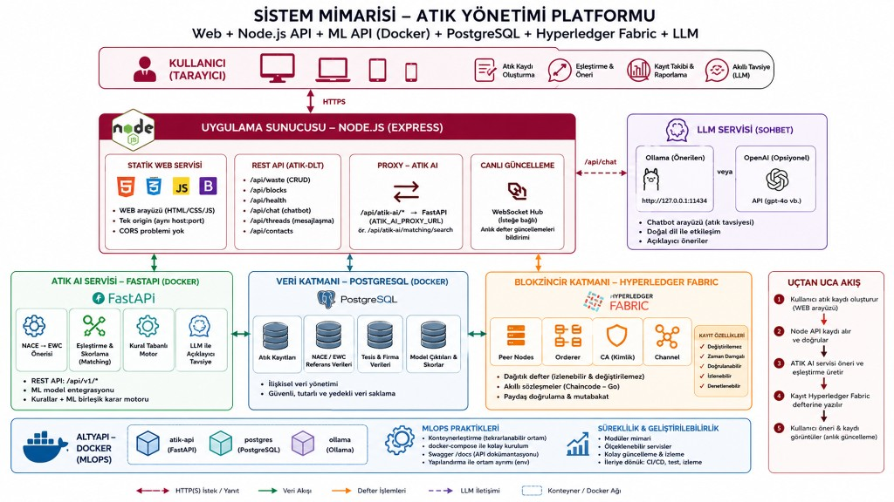
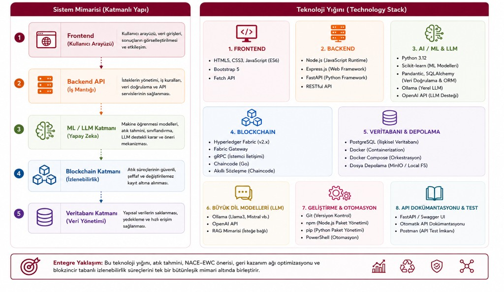
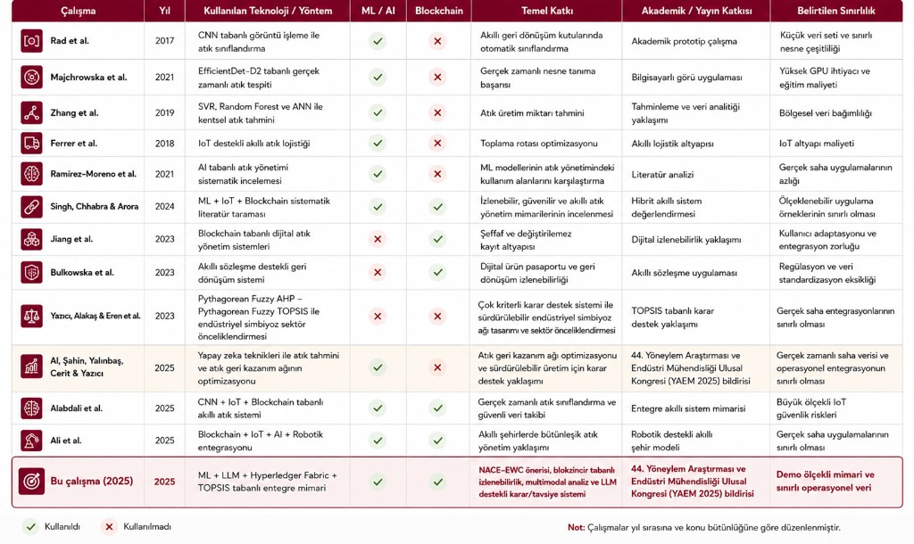
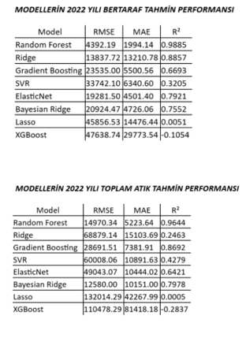
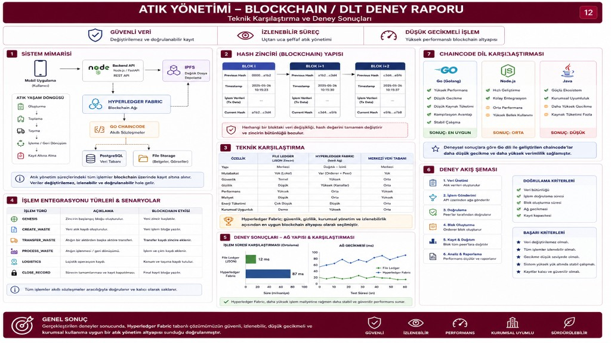

# Atık AI — Blokzincir Destekli Atık Yönetimi ve Karar Destek Platformu

**Entegre mimari:** Makine öğrenmesi · Büyük dil modelleri (LLM) · Hyperledger Fabric · Çok kriterli karar (TOPSIS)

[](https://github.com/busraminal/blokzincir_atik)
[](https://github.com/busraminal/blokzincir_atik)

---

## Özet

Bu depo, döngüsel ekonomi ve atık yönetimi için **uçtan uca bir karar destek ve izlenebilirlik platformu** sunar. Sistem; kullanıcı arayüzü, Node.js tabanlı DLT/API katmanı, FastAPI ile ML/LLM servisi, PostgreSQL veri katmanı ve isteğe bağlı **Hyperledger Fabric** altyapısını tek bir mimaride birleştirir.

**Temel çıktılar**

| Katman | Çıktı |
|--------|--------|
| **ML** | NACE–EWC önerisi, tesis eşleştirme skorları, bertaraf/tahmin modelleri |
| **LLM** | Türkçe atık tavsiyesi, sohbet tabanlı karar desteği (Ollama / OpenAI) |
| **DLT** | Değiştirilemez kayıt, aşama geçişleri, lojistik onayı, blok geçmişi |
| **Web** | Blokzincir takip paneli, rol tabanlı paneller, AI asistan |

**Akademik bağlam:** Çalışma, *44. Yöneylem Araştırması ve Endüstri Mühendisliği Ulusal Kongresi (YAEM 2025)* kapsamında sunulacak bildiri ile uyumludur.

---

## Sistem mimarisi

Platform beş katmanlı bir yapıda tasarlanmıştır: arayüz → iş mantığı API → ML/LLM → blokzincir → ilişkisel veritabanı.



### Uçtan uca akış

1. Kullanıcı web arayüzünden **atık kaydı** oluşturur.
2. **Node.js (atik-dlt)** kaydı doğrular ve deftere yazar (dosya zinciri veya Fabric).
3. **ATIK AI (FastAPI)** NACE–EWC önerisi, eşleştirme ve fizibilite analizi üretir.
4. Kayıt **hash zinciri / Fabric** üzerinde zaman damgalı ve izlenebilir biçimde saklanır.
5. Kullanıcı canlı güncelleme (WebSocket) ve LLM tavsiyesi ile sonucu görür.

### Teknoloji yığını



| Katman | Teknolojiler |
|--------|----------------|
| **Frontend** | HTML5, CSS3, JavaScript, Bootstrap, Fetch API |
| **Backend** | Node.js, Express.js, REST, WebSocket hub |
| **AI / ML** | Python 3.12, FastAPI, scikit-learn, Pydantic, SQLAlchemy |
| **LLM** | Ollama (yerel), OpenAI API (isteğe bağlı) |
| **Blockchain** | Hyperledger Fabric 2.x, Fabric Gateway, gRPC, Chaincode (Go) |
| **Veritabanı** | PostgreSQL 16, Docker Compose |
| **DevOps** | Docker, npm, pip, Git |

---

## Literatürde konumlandırma

Aşağıdaki tablo, benzer çalışmalarla karşılaştırmalı konumlandırmayı özetler. **Bu çalışma**, hem **ML/AI** hem **blokzincir** bileşenlerini aynı entegre mimaride birleştiren az sayıdaki yaklaşımdan biridir.



| Çalışma | Yıl | ML/AI | Blockchain | Öne çıkan katkı |
|---------|-----|:-----:|:----------:|-----------------|
| Rad et al. | 2022 | ✓ | ✗ | CNN ile gerçek zamanlı atık tespiti |
| Zhang et al. | 2023 | ✓ | ✗ | IoT + ML ile sınıflandırma |
| Alabdali et al. | 2025 | ✓ | ✓ | IoT + AI + Blockchain entegrasyonu |
| Ali et al. | 2025 | ✓ | ✓ | Hyperledger Fabric + AI |
| **Bu çalışma** | **2025** | **✓** | **✓** | **ML + LLM + Fabric + TOPSIS; NACE–EWC; çok modlu analiz** |

**Farklılaştırıcı noktalar**

- Standartlaştırılmış **NACE–EWC** eşlemesi ve kural tabanlı + ML hibrit öneri
- **LLM destekli** açıklanabilir tavsiye katmanı
- **Go chaincode** ile kurumsal Fabric uyumu
- Tek portta birleşik web + API + proxy (`atik-dlt`)

---

## Makine öğrenmesi — model performansı (2022)

Bertaraf ve toplam atık tahmininde çoklu regresyon modelleri karşılaştırılmıştır. **Random Forest** her iki görevde de en yüksek **R²** değerini vermiştir.



### Bertaraf tahmini

| Model | RMSE | MAE | R² |
|-------|------|-----|-----|
| **Random Forest** | **4392.19** | **1994.14** | **0.9885** |
| Ridge | 13837.72 | 13210.78 | 0.8857 |
| Gradient Boosting | 23535.00 | 5500.56 | 0.6693 |
| ElasticNet | 19281.50 | 4501.40 | 0.7921 |
| Bayesian Ridge | 20924.47 | 4726.06 | 0.7552 |
| SVR | 33742.10 | 6340.60 | 0.3205 |
| Lasso | 45856.53 | 14476.44 | 0.0051 |
| XGBoost | 47638.74 | 29773.54 | −0.1054 |

### Toplam atık tahmini

| Model | RMSE | MAE | R² |
|-------|------|-----|-----|
| **Random Forest** | **14970.34** | **5223.64** | **0.9644** |
| Gradient Boosting | 28691.51 | 7381.91 | 0.8692 |
| Bayesian Ridge | 12580.00 | 10151.00 | 0.7978 |
| Ridge | 68879.14 | 15103.69 | 0.2463 |
| ElasticNet | 49043.07 | 10444.02 | 0.6421 |
| SVR | 60008.06 | 10891.63 | 0.4279 |
| Lasso | 132014.29 | 42267.99 | 0.0005 |
| XGBoost | 110478.29 | 81418.18 | −0.2837 |

> Üretim ortamında model seçimi veri seti, gecikme ve yorumlanabilirlik kriterlerine göre yeniden doğrulanmalıdır.

---

## Blokzincir / DLT deneyleri

Platform; **dosya tabanlı hash zinciri** (hızlı demo) ve **Hyperledger Fabric** (kurumsal dağıtım) olmak üzere iki modda çalışır.



### Teknik karşılaştırma

| Ölçüt | Dosya zinciri (JSON) | Hyperledger Fabric |
|-------|----------------------|---------------------|
| Güvenlik | Orta (tek makine) | Yüksek (çok düğüm, MSP) |
| Gizlilik | Düşük | Yüksek (kanal yapısı) |
| Kurumsal uyum | Demo / PoC | Üretime yakın |
| Tipik gecikme | ~12 ms (yerel) | ~87 ms (ağ) |
| Chaincode | — | Go (önerilen), JS alternatif |

### İşlem türleri (domain modeli)

| İşlem | Açıklama |
|-------|----------|
| `GENESIS` | Zincirin başlangıç bloğu |
| `CREATE_WASTE` | Yeni atık kaydı |
| `ADVANCE_STAGE` | Yaşam döngüsü aşama geçişi |
| `PATCH_RECORD` | Alan güncelleme + olay günlüğü |
| `LOGISTICS_ATTEST` | Lojistik / konum doğrulama |
| `CLOSE_RECORD` | Kaydı kapatma |

### Chaincode dil karşılaştırması

| Dil | Performans | Geliştirme hızı | Kurumsal uyum | Sonuç |
|-----|------------|-----------------|---------------|--------|
| **Go** | Yüksek | Orta | Yüksek | **Önerilen** |
| JavaScript | Orta | Yüksek | Orta | Alternatif |
| Java | Düşük | Orta | Yüksek | Ağır kaynak |

Detaylı deney şablonları ve rapor metinleri: [`RESULT/BLOCKCHAIN-DENEYLER-VE-KARSILASTIRMA.txt`](RESULT/BLOCKCHAIN-DENEYLER-VE-KARSILASTIRMA.txt)

---

## Depo yapısı

```
atık/
├── WEB/                          # Statik arayüz (blokzincir, paneller, chatbot)
├── BLOCKCHAIN/atik-dlt/          # Node.js API, ledger, Fabric istemcisi
│   ├── server.js                 # REST + WebSocket + statik web
│   ├── lib/ledger.js             # Hash zinciri mantığı
│   ├── chaincode/atik-waste-go/  # Hyperledger Fabric chaincode (Go)
│   └── data/                     # Yerel zincir (gitignore — push edilmez)
├── MACHINE_LEARNING/
│   └── atik_ai_multi_agent_decision-main/  # FastAPI kaynak kodu
├── MLOPS/                        # Docker Compose (Postgres + API)
├── RESULT/                       # Demo akışı, deney notları
├── docs/figures/                 # README şekilleri
├── start-atik-dev.ps1            # Tek tık geliştirme başlatıcı
└── package.json                  # npm start → atik-dlt
```

---

## Hızlı başlangıç

### Gereksinimler

- **Node.js** 18+
- **Docker Desktop** (ML API + Postgres için)
- **Ollama** (yerel LLM; isteğe bağlı profil ile Docker içi de mümkün)
- **Git**

### 1) ML API ve veritabanı (Docker)

```powershell
cd MLOPS
docker compose up --build -d
```

- Swagger: http://127.0.0.1:8000/docs  
- Postgres: `localhost:5432` — kullanıcı `postgres` / şifre `admin` / DB `postgre_database`

### 2) Web + blokzincir API (Node)

```powershell
# Proje kökünden — Ollama + API + tarayıcıyı açar
.\start-atik-dev.ps1
```

veya:

```powershell
cd BLOCKCHAIN\atik-dlt
copy .env.example .env    # ilk kurulum
npm install
npm start
```

**Önemli:** Sayfayı Live Server (`5501`) ile değil, **http://127.0.0.1:5055/blokzincir.html** adresinden açın.

### 3) Ollama (LLM)

```powershell
ollama serve
# Örnek model: gemma3:4b
```

Docker API için `MLOPS/docker-compose.yml` içinde `OLLAMA_MODEL=gemma3:4b` ve `OLLAMA_BASE_URL=http://host.docker.internal:11434` tanımlıdır.

### Sağlık kontrolleri

| Servis | URL |
|--------|-----|
| DLT API | http://127.0.0.1:5055/health |
| Blokzincir UI | http://127.0.0.1:5055/blokzincir.html |
| ATIK AI | http://127.0.0.1:8000/api/v1/health/ |
| LLM köprüsü | http://127.0.0.1:8000/api/v1/predict/health-llm |

---

## Önemli API uçları

### Node (atik-dlt) — port 5055

| Metot | Uç | Açıklama |
|-------|-----|----------|
| GET | `/health` | Mod, kayıt sayısı, LLM durumu |
| GET/POST | `/api/waste` | Kayıt listesi / oluşturma |
| POST | `/api/waste/:id/advance` | Aşama ilerletme |
| GET | `/api/blocks` | Blok listesi |
| POST | `/api/chat` | LLM sohbet (Ollama/OpenAI) |
| WS | `/ws/hub` | Canlı defter güncellemeleri |

### FastAPI (ATIK AI) — port 8000

| Metot | Uç | Açıklama |
|-------|-----|----------|
| GET | `/api/v1/predict/ewc-by-nace?nace=24.10` | NACE → EWC önerisi |
| POST | `/api/v1/llm/chat` | OpenAI uyumlu sohbet |
| POST | `/api/v1/llm/waste-advice?nace_code=38.12` | Kısa atık tavsiyesi |
| GET | `/api/v1/facilities/{id}/matches` | Tesis eşleşmeleri |

Tam liste: http://127.0.0.1:8000/docs

---

## Fabric (kurumsal mod)

Gerçek Hyperledger Fabric ağı için:

```powershell
cd BLOCKCHAIN\atik-dlt
# .env içinde USE_FABRIC=1
npm run start:fabric
```

Kurulum adımları: `BLOCKCHAIN/atik-dlt/TAM-KURULUM.txt`, `FABRIC-Gercek-Sistem.txt`

---

## Gizlilik ve yerel dosyalar

Aşağıdakiler **depoya push edilmez** (`.gitignore`):

- `.env` (API anahtarları, portlar)
- `BLOCKCHAIN/atik-dlt/data/` (yerel zincir verisi)
- `contact_threads.json` (kişisel mesajlar)
- `node_modules/`

İlk kurulumda `BLOCKCHAIN/atik-dlt/.env.example` dosyasını `.env` olarak kopyalayın.

---

## Demo hesapları (geliştirme)

| Rol | E-posta | Şifre |
|-----|---------|-------|
| Yönetici | `yonetici@atik.demo` | `AtikDemo2026!` |
| Üretici | `uretici@atik.demo` | `AtikDemo2026!` |
| Taşıyıcı | `tasiyici@atik.demo` | `AtikDemo2026!` |

> Yalnızca yerel geliştirme içindir; üretimde sunucu tarafı kimlik doğrulama kullanın.

---

## Sunum / rapor için önerilen anlatım

> *"Kullanıcı arayüzünden atık kaydı oluşturuluyor; kayıt Node API ile hash zincirine yazılıyor; ATIK AI servisi NACE–EWC önerisi ve eşleştirme skorları üretiyor; LLM katmanı kararı Türkçe açıklıyor; Hyperledger Fabric ile kurumsal izlenebilirlik sağlanabiliyor."*

Ek notlar: [`RESULT/DEMO-AKIS.txt`](RESULT/DEMO-AKIS.txt)

---

## Katkı ve lisans

Bu depo akademik ve araştırma amaçlı geliştirilmiştir. Katkılar için issue veya pull request açabilirsiniz.

**Bağlantılar**

- GitHub: https://github.com/busraminal/blokzincir_atik
- Kongre: YAEM 2025 — Yöneylem Araştırması ve Endüstri Mühendisliği Ulusal Kongresi

---

*Son güncelleme: 2026 — Atık AI Platformu*
